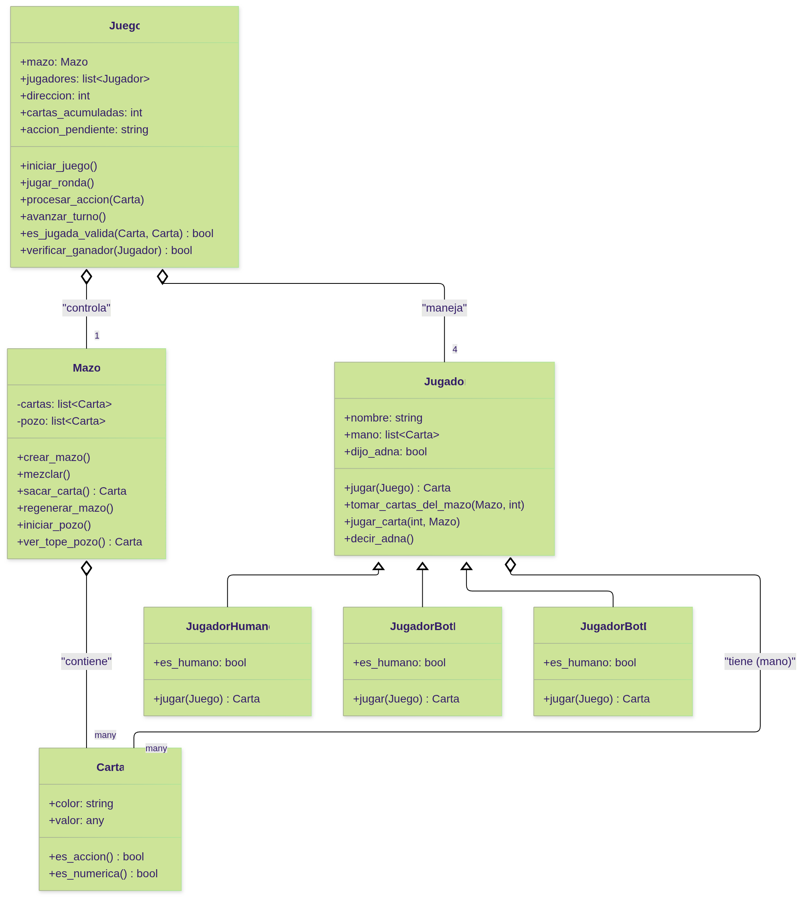

# Implementación del juego Одна - UMET 2025

Emanuel Guillén - Noviembre 2025

## Diagrama de clases



## Explicación del código

El código se estructura alrededor de cuatro clases principales: Carta, Mazo, Jugador y Juego.

### A. Clase Carta

Representa una carta individual. Cada carta tiene un color y un valor. El valor puede ser un número (1-9) o un tipo de acción (Toma 2, Toma 4, Saltar, Reversa)

```python
class Carta:
    """
    Representa una carta individual del juego.
    """
    def __init__(self, color, valor):
    self.color = color
    self.valor = valor # Puede ser un número (1-9) o un tipo de acción

    def __str__(self):
        # Dice valor y color
        return f"{self.valor} {self.color}"

    def es_accion(self):
        # chequea si el valor está en los tipos de acción
        return self.valor in TIPOS_ACCION

    def es_numerica(self):
        # isinstance valida el tipo de valor de la variable
        return isinstance(self.valor, int)
```

### B. Clase Mazo

Representa tanto el mazo de donde se roban cartas como el "pozo".
Tiene los siguientes métodos:

- crear_mazo(): Sigue las reglas para crear las 100 cartas (72 numéricas, 28 de acción).
- sacar_carta(): Toma una carta del mazo. Si el mazo se vacía, llama a regenerar_mazo().
- regenerar_mazo(): Si el mazo se acaba, toma todas las cartas del pozo (excepto la superior), las mezcla y las usa como nuevo mazo.
- iniciar_pozo(): Se asegura de que el juego comience con una carta numérica en el pozo.

```python
class Mazo:
    """
    Representa el Mazo y el Pozo.
    """
    def __init__(self):
    self.cartas = []
    self.pozo = []
    self.crear_mazo()
    self.mezclar()

    def sacar_carta(self):
        """
        Saca una carta del tope del mazo.
        Maneja el coso de cuando el mazo se termina y comienza de nuevo
        """
        if not self.cartas:
            print("Mezclando el pozo...")
            self.regenerar_mazo()
            # ... (manejo de mazo vacío) ...
        return self.cartas.pop()

    def iniciar_pozo(self):
        """
        Inicio el pozo, doy vueltas cartas hasta que sea numérica
        """
        carta = self.sacar_carta()
        while carta.es_accion():
            print(f"Salió una carta de acción ({carta}). Agarrando la siguiente...")
            self.pozo.append(carta)  # Se pone en el pozo igualmente
            carta = self.sacar_carta()
        self.pozo.append(carta)
```

### C. Clases de Jugador

Se utiliza una clase base Jugador de la cual heredan los jugadores humanos y los bots.

#### 1. Clase Jugador (Base)

Define el comportamiento y atributos comunes a todos los jugadores: un nombre, una mano (lista de cartas) y un indicador booleano dijo_adna.

```python
class Jugador:
    """
    Clase base para todos los jugadores.
    """
    def __init__(self, nombre):
    self.nombre = nombre
    self.mano = []
    self.dijo_adna = False

    def tomar_cartas_del_mazo(self, mazo, cantidad=1):
        # ...
        self.dijo_adna = False  # Si agarra cartas, no va a tener adná

    def jugar_carta(self, carta_idx, mazo):
        # ...
```

#### 2. Clase JugadorHumano

Clase que depende de la clase Jugador.

Tiene los métodos

- mostrar_mano(): que muestra la mano del jugador
- jugar(): que muestra las opciones disponibles y procesa la entrada del usuario

```python
class JugadorHumano(Jugador):
    def jugar(self, juego):
    """
    Lógica para que el humano elija qué hacer
    """
    self.mostrar_mano()
    print(f"Tope del pozo: {juego.mazo.ver_tope_pozo()}")

        # ... (Lógica para manejar acumulación de cartas) ...

        print("Opciones:")
        print("  1. Jugar una carta (ingrese el número de la carta)")
        print("  2. Jugar carta y decir '¡Adná!'")
        print("  3. Tomar una carta del mazo")

        decision = int(input("¿Qué hacés? "))
        match decision:
            # ... (Manejo de casos 1, 2 y 3) ...
```

#### 3. Clases de Bots

Ambos bots heredan de Jugador pero implementan lógicas diferentes en su método jugar().

**JugadorBotB**: Prioriza "atacar" al siguiente jugador.

- Siempre responde a un ataque si puede (acumulando "Toma 2" o "Toma 4").
- Busca jugar cartas de "Toma", "Salta" o "Reversa" antes que cartas numéricas.
- Si juega numéricas, intenta cambiar a un color que infiere (basado en el pozo) que el siguiente jugador no tiene.

**JugadorBotD**: Prioriza su propia mano y se defiende.

- Solo juega acciones de "Toma" para defenderse de un ataque (acumular).
- Prioriza jugar cartas numéricas para deshacerse de ellas. Al hacerlo, elige un color del que tenga muchas cartas en su mano, para maximizar sus propias probabilidades futuras.
- Guarda cartas de acción para el final.

```python

class JugadorBotD(Jugador):
        def jugar(self, juego):
        """
        Estrategia "conservadora": 1. Juega acciones solo para responder a acciones Toma 2 y Toma 4 2. Prioriza jugar cartas numéricas. Usa el pozo para seleccionar que numero/color jugar 3. Guardar cartas de acción (Toma, Salta, Reversa) para jugar a lo último y solo las juega si no queda otra
        """ # ... (Lógica de clasificación de cartas) ...

        if numericas:
            # Contar qué colores y números hay en mi PROPIA mano.
            conteo_colores_mano = Counter(c.color for c in self.mano)
            # ...
            # Ordena las cartas numéricas, prefiriendo las de colores
            # que tiene MÁS en su mano.
            numericas.sort(key=lambda c: conteo_colores_mano[c.color], reverse=True)
            carta_a_jugar = numericas[0]

        # ...
```

### D. Clase Juego

Esta es la clase principal que maneja todo el flujo de la partida.

- \_\_init\_\_(): Inicializa el Mazo y crea la lista de jugadores (2 humanos, 2 bots).
- repartir_inicial(): Da 5 cartas a cada jugador.
- jugar_ronda(): Es el bucle principal del juego.

  - Limpia la pantalla (clear_screen()).
  - Verifica si el jugador actual olvidó decir "Adná" en el turno anterior (penalidad_adna).
  - Muestra el estado del juego si el jugador es humano.
  - Llama al método jugar() del jugador actual (sea humano o bot).
  - Verifica si el jugador ganó (verificar_ganador).
  - Procesa la acción de la carta jugada (procesar_accion).
  - Pasa al siguiente jugador (avanzar_turno).
  - procesar_accion(): Es clave para la lógica del juego. Maneja los efectos de "Reversa" (cambia self.direccion), "Salta" (llama avanzar_turno() una vez extra) y las cartas "Toma 2" y "Toma 4", gestionando la acumulación (atributo `cartas_acumuladas`).

```python

class Juego:
    """
    Controla todo el flujo de la partida.
    """
    def __init__(self):
    self.mazo = Mazo()
    self.jugadores = [
    JugadorHumano("A"),
    JugadorBotB("B"),
    JugadorHumano("C"),
    JugadorBotD("D"),
    ]
    self.jugador_actual_idx = 0
    self.direccion = 1 # 1 para A->B->C->D, -1 para A->D->C->B

        # Variables para acumulación de acciones
        self.cartas_acumuladas = 0
        self.accion_pendiente = None  # "TomaDos", "TomaCuatro"

    def procesar_accion(self, carta):
        """
        Procesa los efectos de las cartas de acción
        """
        if not carta:
            # El jugador tomó carta, no hay acción que procesar
            return

        if carta.valor == "Reversa":
            self.direccion *= -1
            # ...
        elif carta.valor == "Salta":
            self.avanzar_turno()  # Salta al siguiente
            # ...
        elif carta.valor == "Toma 2":
            self.cartas_acumuladas += 2
            self.accion_pendiente = "Toma 2"
            # ...
        elif carta.valor == "Toma 4":
            self.cartas_acumuladas += 4
            self.accion_pendiente = "Toma 4"
            # ...

    def jugar_ronda(self):
        """
        Ejecuta un turno completo.
        """
        # ...
        while True:  # Bucle principal del juego
            jugador = self.jugadores[self.jugador_actual_idx]

            # si no dijo ADNA, lo penalizo y paso al siguiente
            if len(jugador.mano) == 1 and not jugador.dijo_adna:
                self.penalidad_adna(jugador)
                self.turno_activo = False

            # ... (Lógica del turno) ...

            carta_jugada = jugador.jugar(self)

            if self.verificar_ganador(jugador):
                break  # Termina el juego

            self.procesar_accion(carta_jugada)
            self.avanzar_turno()
```
